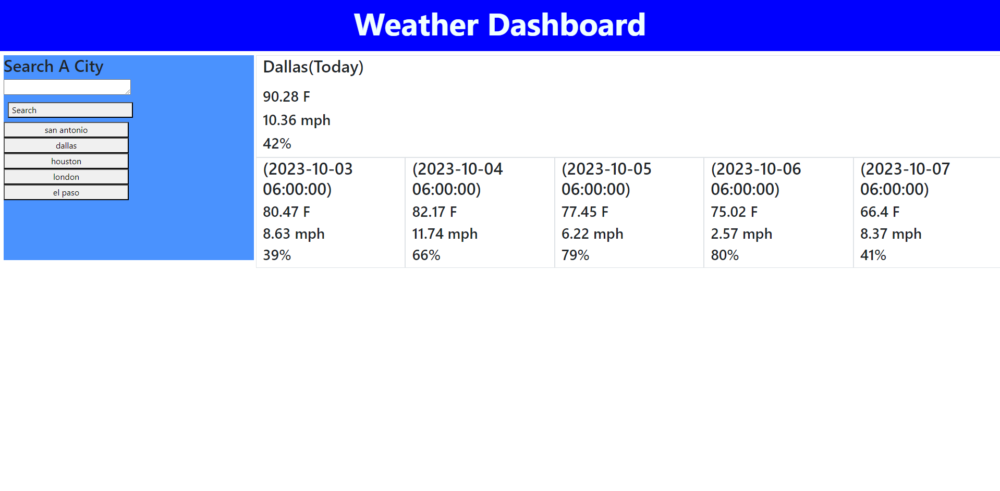

# WeekSixChallenge_WeatherDashboard

## Description

My motivation for doing this project was to improve my skills on how server-side APIs work. I built this project to help me further understand how server-side APIs help use create better webesites. This webesite solves the problem of having easy access to todays weather in what ever city you want and its five day forcast. I learned from creating this project was that server-side APIs are useful to me to get data to create more useful webesites.

## Usage

You can use the search bar to look up a city and get its weather forcast. Once you look up a city it will be added to your search history, so all you have to do is click on the button to load up the city again.

Link to webpage: (https://foundeven.github.io/WeekSixChallenge_WeatherDashboard/)